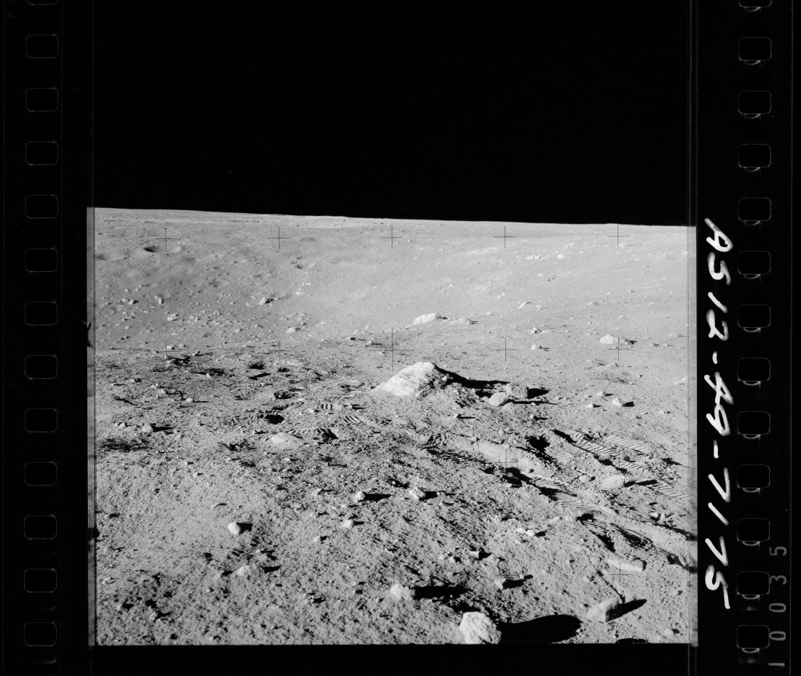
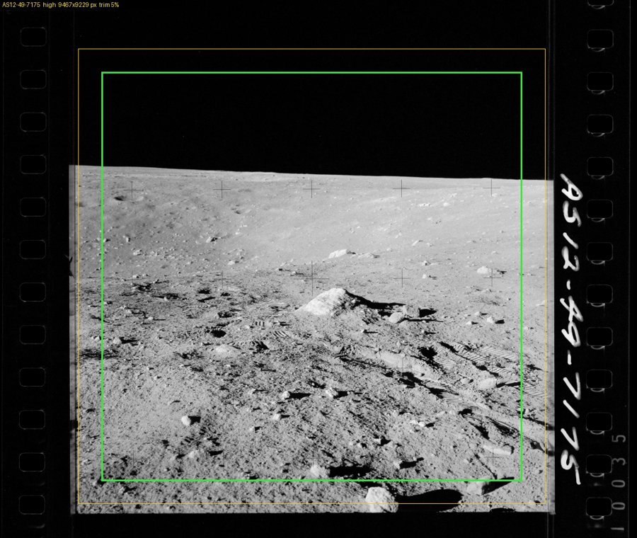
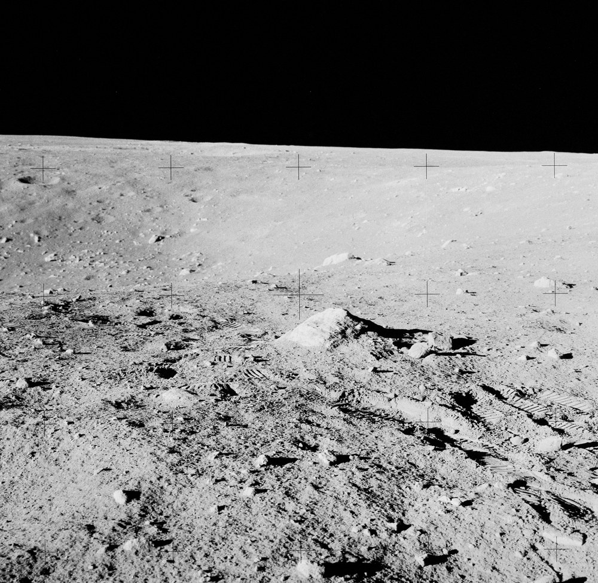
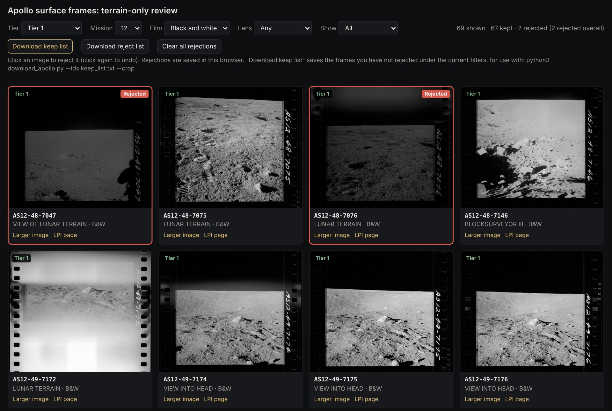

# Apollo Lunar Surface Terrain Images

Tools for finding, reviewing and downloading photographs of the lunar terrain taken by Apollo
astronauts standing on the Moon, cropped to the exposed picture at full scan resolution.

The project starts from every 70 mm Hasselblad frame shot on the lunar surface during Apollo 11,
12, 14, 15, 16 and 17 (7,073 frames). It screens out frames whose catalog descriptions mention
hardware, astronauts, footprints, tracks or other man-made content, and lets you review the
remaining candidates visually in a browser. It then downloads the frames you keep from the NASA
film scans and crops each one to the exposed picture area, saving it as a 16-bit TIFF (Tagged
Image File Format) file at the original scan resolution.

| Raw film scan | Detected picture (yellow) and saved area (green) | Cropped output |
|:---:|:---:|:---:|
|  |  |  |
| 14,346 × 12,136 px, 16-bit, 348 MB | | 9,467 × 9,229 px, 16-bit, 175 MB |

*AS12-49-7175, Apollo 12, looking into Head Crater. The raw scan includes the film border,
sprocket holes and the handwritten frame number. The cropped output keeps only the picture,
trimmed by a further 5% on each side. The small "+" marks are reseau crosses etched on a glass
plate inside the camera; they are part of every picture and cannot be cropped out. Images shown
here are reduced in size.*

This example also shows why the visual review step matters: the NASA catalog describes the
frame only as "View into Head", so it passed the text screening, but bootprints are visible in
the foreground.

## Contents

| File | What it is |
|---|---|
| `review.html` | Browser page for reviewing candidate frames and saving a keep list |
| `download_apollo.py` | Downloads frames, optionally cropping them to the picture area |
| `apollo_crop.py` | Frame detection and TIFF cropping, used by `download_apollo.py --crop` |
| `apollo_surface_frames.csv` | All 7,073 surface frames, with tier, reasons and download links |
| `apollo_surface_candidates.xlsx` | The same list as a spreadsheet, with summary and per-magazine sheets |
| `docs/images/` | Images used in this README |

## How the candidate list was made

The list was built once, in October 2026, from three catalogs.

1. **Surface magazines.** The Lunar and Planetary Institute (LPI) Apollo Image Atlas counts
   surface and orbital frames for each film magazine, and the Apollo Lunar Surface Journal (ALSJ)
   notes how each magazine was used. Together they identify the 49 magazines used on the
   surface.
2. **Descriptions.** Each frame's description was collected from the NASA catalog (through LPI
   and through Arizona State University (ASU)) and from the ALSJ image captions.
3. **Screening.** A frame is excluded if any source mentions the Lunar Module (LM), the rover,
   instruments, tools, an astronaut, footprints, tracks or shadows, or if it was taken through
   an LM window, from inside the cabin, in orbit, outside the extravehicular activity (EVA)
   periods, or is blank or badly exposed. Each excluded frame lists its reasons.
4. **Tiers.** The remaining frames are sorted by how much the text says about them.

| Tier | Meaning | Black and white | Color |
|---|---|---:|---:|
| Tier 1 | Described, with nothing that suggests man-made content | 1,193 | 273 |
| Tier 2 | A caution flag: sample documentation (a gnomon is often in view), taken near the LM, rover or experiment site, taken from the moving rover, or a crew member named in the caption | 859 | 744 |
| Tier 3 | No description in any source | 2 | 0 |
| Excluded | At least one reason to exclude | 2,102 | 1,900 |

Captions describe what a photograph was taken *of*, not everything in it, so footprints and
tracks in the foreground are often not mentioned. Treat the tiers as a shortlist and use
`review.html` for the final choice.

## Requirements and installation

- Python 3.8 or newer
- For cropping: [numpy](https://numpy.org) and [Pillow](https://python-pillow.org)
- Recommended: [certifi](https://pypi.org/project/certifi/), which supplies the security
  certificates that Python installed from python.org on a Mac lacks
- An internet connection, and enough disk space (see [Disk space and time](#disk-space-and-time))

```bash
git clone <this repository>
cd <repository folder>
python3 -m pip install numpy pillow certifi
```

On Windows, use `py` in place of `python3`. The scripts were developed on macOS and Linux and
have not been tested on Windows.

## Quick start

1. **Review the candidates.** Open `review.html` in a web browser, set the filters to the frames
   you want to consider, click any frame you do not want, and click **Download keep list**. Move
   the downloaded `keep_list.txt` into this folder. (The page is described in
   [Reviewing candidates](#reviewing-candidates-with-reviewhtml).)
2. **Test with three frames.**
   ```bash
   python3 download_apollo.py --ids keep_list.txt --crop --limit 3
   ```
3. **Check every crop before the large download.** This fetches only preview images (about
   20 MB per frame, not kept) and writes a small check image for each frame.
   ```bash
   python3 download_apollo.py --ids keep_list.txt --crop --crop-preview-only --yes
   ```
   Open `apollo_images/crop_review.html`, click any crop that looks wrong, and click
   **Download list of marked frames** to save `bad_crops.txt`.
4. **See the sizes and check disk space.**
   ```bash
   python3 download_apollo.py --ids keep_list.txt --crop --dry-run
   ```
5. **Download and crop.**
   ```bash
   python3 download_apollo.py --ids keep_list.txt --crop --skip-ids bad_crops.txt
   ```

To save to another drive, add `--out /path/to/folder` to steps 3 to 5, using the same folder each
time so the crops worked out in step 3 are reused. You can stop a run with Ctrl+C at any time;
running the same command again resumes where it stopped.

## Reviewing candidates with review.html



`review.html` is a single page that runs in any modern browser. Preview images load from the
ASU archive as you scroll, so it needs an internet connection.

**Filters (top row)**

| Control | Choices |
|---|---|
| Tier | Tier 1, Tier 2, Tier 3, or All candidates |
| Mission | All, or Apollo 11, 12, 14, 15, 16 or 17 |
| Film | Any, Color, or Black and white |
| Lens | Any, or 500 mm only (telephoto views of distant hills and massifs) |
| Show | All, Kept only, or Rejected only |

The counter at the right shows how many frames match the filters, how many of those are kept
and rejected, and the total number of rejections across all filters.

**Frame cards.** Each card shows a preview of the whole film scan with its tier badge, the frame
ID, the NASA catalog description, the lens focal length when known, and the film type. Tier 2
cards also list their caution flags in amber. **Larger image** opens a 1,100 px preview, and
**LPI page** opens the frame's entry in the LPI Apollo Image Atlas.

**Rejecting frames.** Click a picture to reject it; the card gets a red outline and a
**Rejected** tag. Click again to undo. Rejections are saved in your browser's storage for this
page, so they survive closing the browser, but they stay on that computer and browser and are
lost if you clear its site data. Use **Download reject list** to keep a copy.

**Buttons**

| Button | What it does |
|---|---|
| Download keep list | Saves `keep_list.txt`: every frame that matches the **current filters** and is not rejected. Set the filters to the full set you want (for example Tier: All candidates, Film: Black and white) before clicking. |
| Download reject list | Saves `reject_list.txt`: every rejected frame, whatever the filters. Use it with `--skip-ids`. |
| Clear all rejections | Removes all rejections, after asking you to confirm. |

## Downloading and cropping

### How cropping works

For each frame, `download_apollo.py --crop`:

1. reads the header of the raw scan (a few hundred kilobytes) to learn its size and layout;
2. finds the picture in the small and medium preview images: first the frame's position, then
   each straight edge of the picture, to within about ten pixels at full resolution;
3. trims a further 5% of the picture's width and height from every side (`--crop-inset`);
4. downloads only the rows of the raw scan that fall inside the crop, using HTTP range requests;
5. writes the crop as an uncompressed 16-bit TIFF with the scan's resolution tags and a
   description recording the source address and crop coordinates.

Pixels are copied exactly; nothing is resampled. The scans are rotated by up to about 1 degree,
which is not corrected: the crop is the largest upright rectangle inside the tilted picture.

**Why the extra 5% trim.** It guarantees a clean edge. The largest edge error measured during
development was about 1.5% of the picture width, so a 5% trim leaves a wide margin. On a test of
53 black-and-white frames drawn from all 25 black-and-white candidate magazines, every 5% crop
was free of film border, sprocket holes and frame numbers. The trim keeps 81% of the picture
area. Use `--crop-inset 0` for the tightest crop, or another value in percent. Changing the trim
later reuses the saved detection, so frames are not detected again.

When an edge of the picture cannot be seen (usually black sky against the black film border),
that side is placed from the opposite edge and the known frame size, with an extra 1% margin.

### Output files

```
apollo_images/
  crop_review.html          review page for all crops (see below)
  crops.csv                 one row per frame: confidence, crop box, size, edges found
  crops_to_check.txt        frames whose crop is worth a look (not high confidence)
  manifest.csv              one line per file per run: status, size, path, source address
  AS12/
    AS12-49/
      AS12-49-7175.crop.tif         the cropped image
      AS12-49-7175.crop-check.jpg   preview with the detected picture (yellow) and crop (green)
      AS12-49-7175.crop.json        detection record, reused on later runs
```

Partial downloads (`.rows`, `.part`) are kept only while a frame is in progress, so an
interrupted run can resume.

### Checking crops with crop_review.html

Every `--crop` run, including `--crop-preview-only`, rebuilds `apollo_images/crop_review.html`.
It shows the check image for every frame, like the middle image at the top of this page: the
thin yellow line is the detected edge of the picture and the green box is what is saved.

Each frame has a confidence label:

| Confidence | Meaning |
|---|---|
| high | Three or four edges of the picture were found in the image |
| medium | Two edges were found; the others were placed from the frame size |
| low | One edge or none was found, or the frame's size or position is unusual for its film type |

Low (red outline) and medium (orange outline) frames are listed first. Click any frame whose
crop looks wrong, then click **Download list of marked frames** to save `bad_crops.txt` for
`--skip-ids`. These marks are not saved by the page, so download the list before closing it.

## Command reference

```
python3 download_apollo.py [options]
```

| Option | Meaning |
|---|---|
| `--ids FILE` | Frame IDs to download, one per line (for example the keep list from `review.html`). Blank lines and text after `#` are ignored. |
| `--skip-ids FILE` | Frame IDs to leave out (for example `reject_list.txt` or `bad_crops.txt`) |
| `--tier T1 T2 ...` | Tiers to download when `--ids` is not given (default `T1`; also `T3`, `EXCLUDE`, `ALL`) |
| `--mission 11 12 ...` | Only these missions |
| `--film any\|color\|bw` | Only color or only black-and-white frames |
| `--crop` | Crop to the picture and save 16-bit TIFFs (works on the raw scans) |
| `--crop-preview-only` | With `--crop`: work out the crops and check images without downloading raw scans |
| `--crop-inset PCT` | With `--crop`: extra trim on every side, in percent of the picture size (default 5) |
| `--no-check-images` | With `--crop`: do not write the `.crop-check.jpg` files |
| `--res raw\|processed\|preview\|small\|lpi` | Without `--crop`: which version to download (default `raw`) |
| `--out FOLDER` | Output folder (default `./apollo_images`) |
| `--limit N` | Only the first N frames, for a test run |
| `--dry-run` | Show the number of frames, sizes and free disk space, and stop |
| `--max-gb N` | Stop before starting if the total is larger than N GB |
| `--workers N` | Parallel downloads (default 2; please keep this low) |
| `--yes` | Do not ask for confirmation before starting |
| `--no-size-check` | Skip the size check before downloading |
| `--rewrite-host OLD=NEW` | Replace the start of every download address, for example if the archive moves |

Without `--crop`, these versions are available:

| `--res` | What you get | Size per frame |
|---|---|---|
| `raw` | Raw 16-bit TIFF scan, including the film border | 0.35 GB black and white, 1.36 GB color |
| `processed` | Processed PNG of the same scan, including the border | 0.17 GB black and white, 0.30 GB color |
| `preview` | Medium PNG, about 3,600 px across | about 18 MB |
| `small` | Quick-look PNG, about 1,100 px across | about 1.6 MB |
| `lpi` | LPI print JPG, already cropped, 8-bit, 3,900 px (available for some frames only) | 4 to 8 MB |

## Disk space and time

Raw scans are 14,346 × 12,136 px for black-and-white film and 14,160 × 16,020 px for color. The
picture is about 10,500 px across, roughly 52 mm of the 70 mm film at about 5,130 dots per
inch (dpi). With the default 5% trim, a cropped frame is about 9,500 px across.

| Per frame, 5% trim | Downloaded | Saved |
|---|---:|---:|
| Black and white | about 290 MB | about 180 MB |
| Color | about 0.8 GB | about 0.5 GB |

For 1,000 black-and-white frames, expect about 290 GB downloaded and 180 GB on disk. At a steady
100 megabits per second that takes about 6.5 hours, but the archive's actual speed varies. Run
with `--dry-run` for figures based on the exact file sizes.

## Troubleshooting

**`CERTIFICATE_VERIFY_FAILED`.** Python cannot verify the archive's security certificate. This is
common with Python from python.org on a Mac. Run `python3 -m pip install certifi`, or open
Applications > Python 3.x in Finder and double-click **Install Certificates.command**. Then run
the same command again.

**`No module named numpy` or `No module named PIL`.** Run `python3 -m pip install numpy pillow`.

**A run was interrupted.** Run the same command again. Finished frames are skipped and partial
downloads resume.

**"missing on server".** A few frames listed in the catalogs are not in the ASU archive. They are
skipped and recorded in `manifest.csv`.

**A crop looks wrong.** Mark it in `crop_review.html` and rerun with `--skip-ids bad_crops.txt`.
To set a crop by hand, edit the `crop` values (x0, y0, x1, y1 in raw-scan pixels) in that frame's
`.crop.json`, delete its `.crop.tif`, and rerun with the same `--crop-inset`. (Changing the trim
later recalculates the crop from the detected picture and replaces a hand edit.)

## Limitations

- The text screening cannot see the pictures. Footprints, tracks and distant hardware are often
  missing from captions, so a visual review is needed.
- Crop detection was checked on samples, not on every frame. The check images and
  `crop_review.html` are there so each crop can be confirmed.
- Downloads depend on the ASU archive's current addresses. If they change, `--rewrite-host` can
  redirect them.

## Data sources and credits

- **Photographs:** NASA, taken by the Apollo 11, 12, 14, 15, 16 and 17 crews.
- **Film scans:** NASA Johnson Space Center (JSC) scans, served by Arizona State University's
  [March to the Moon](https://tothemoon.im-ldi.com/gallery/Apollo) archive.
- **Catalog descriptions:** [LPI Apollo Image Atlas](https://www.lpi.usra.edu/resources/apollo/catalog/70mm/).
- **Captions used for screening:** [Apollo Lunar Surface Journal](https://www.apollojournals.org/alsj/)
  image libraries. The captions themselves are not included in this repository.

NASA images are generally not subject to copyright in the United States; see NASA's
[media usage guidelines](https://www.nasa.gov/multimedia/guidelines/index.html). Please credit
NASA and the archive that supplied the scan. The archives are public research resources, so
please keep downloads modest (the default of two at a time is deliberate).
